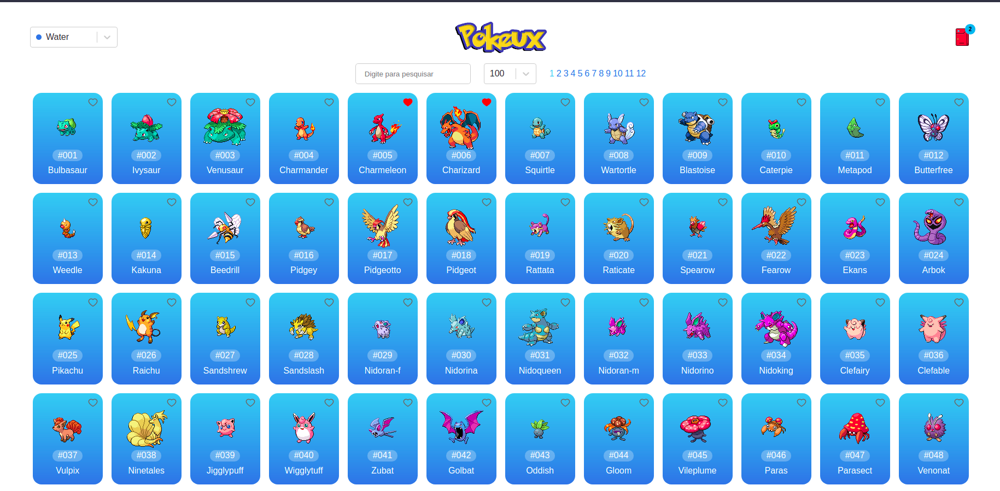

# **:iphone: Pokeux**

A simple Pokedex in your browser to see all pokemons. [Access the demo.][demo]

## :bulb: Objective

This application intends to be a pokedex in your browser where you can find pokemons, see their specs and add them to your pokedex. Also, you can style the whole app with your favorite pokemon type

## :heavy_check_mark: Features

### :computer: Web

- Search of pokemons

- Favorite list (Pokedex)

- Pokemon card with specifications

- Theme switcher based on pokemon types

## :art: Layout

<h1 align="center">
    
</h1>

## **:wrench: Technologies**

### :computer: Website

- React
- Redux
- Styled-Components
- Typescript
- GraphQL

## :books: How to use

:computer: **Website**

```sh

# Start the website


$ npm start

or

$ yarn start


# The app will be running on port 3000

```

## :open_book: How to contribute

1. Make a **fork**.

2. Make a new branch with your changes: `git checkout -b my-feature`

3. Save your changes and make a commit with a cool message: `git commit -m "feat: My new feature"`

4. Send your changes: `git push origin my-feature`

> If a question persists, see [how to contribute in GitHub](https://github.com/firstcontributions/first-contributions)

## :memo: License

This project is under the **MIT License**. See [LICENSE][license] to know more.

---

<h4  align="center">

Made with ❤️ by <a  href="https://www.linkedin.com/in/rikelme-griep-b265a51ab"  target="_blank">Rikelme Griep</a>

</h4>

[license]: https://opensource.org/licenses/MIT
[demo]: https://pokeux.vercel.app/
